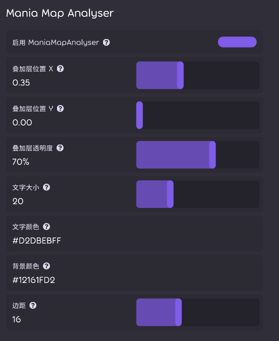

# 项目说明

本项目是 [osumania_map_analyser](https://github.com/LeoBlackMT/osumania_map_analyser) 的ruleset改版。

## 功能

仅保留预估对应rf和ln段位，如图




## 安装

右侧Release下载文件，将下载的dll文件放到rulesets目录下

如果从源码拉取，请记得初始化 submodule：

```powershell
git submodule update --init --recursive
```

## 项目

- osu.Game.Rulesets.ManiaMapAnalyser：改造后的规则集代码
- osumania_map_analyser：https://github.com/LeoBlackMT/osumania_map_analyser 原始项目，submodule，固定到 v1.4.2
- external_repos\companella：https://github.com/Leinadix/companella 项目，submodule，固定到 commit `cec0589`
- external_repos\etterna：https://github.com/etternagame/etterna 项目，submodule，固定到 v0.74.4
- examples：用于测试的几个osu文件
- src：osumania_map_analyser：核心功能提取后文件，输入json，输出json
- OsuManiaMapAnalyser.Core：osumania_map_analyser/companella/etterna 功能提取出来的c#算法核心，输入json，输出json
- OsuManiaMapAnalyser.Cli：测试 OsuManiaMapAnalyser.Core 是否正常